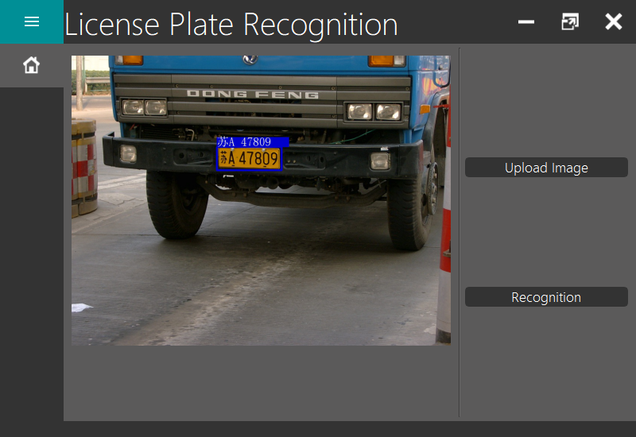
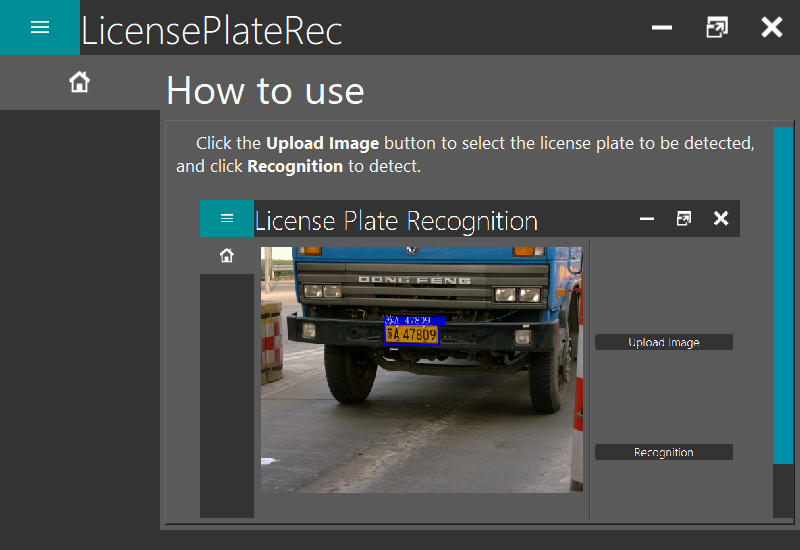

<h1 align="center">LicensePlateRec</h1>

[](https://github.com/laugh12321/LicensePlateRec/blob/master/LICENSE) [](https://github.com/laugh12321/LicensePlateRec) [](https://github.com/laugh12321/LicensePlateRec) [](https://github.com/laugh12321/LicensePlateRec/issues)


<p align="center">
    <em>Simple license plate recognition software. Inspired by <a href="https://github.com/Buster-maker/plate">Buster-maker/plate</a>, but more features.</em>
</p>

<p align="center">
  
</p>


## ⭐️Features

* 车牌识别

## 💡Usage

<b>Note:</b>选择图片位置时不能包含中文路径！！！！

### Source Code

```python
python main.py
```

#### Prerequisites

- PySide2
- Pytorch
- Opencv
- Pyinstaller

### Releases

<p align="center">
  
</p>

## 📅 Changelog

<b>v1.0.0-alpha - 2021-04-13</b>
* Add: 增加程序图标

## 📌 ToDO

- ✅增加程序图标

- 🔳支持实时检测功能

- 🔳增加 Setting 页面

## 📄License
MIT.

## 📃Reference

- [Minimalistic-Flat-Modern-GUI-Template](https://github.com/laugh12321/Minimalistic-Flat-Modern-GUI-Template)s